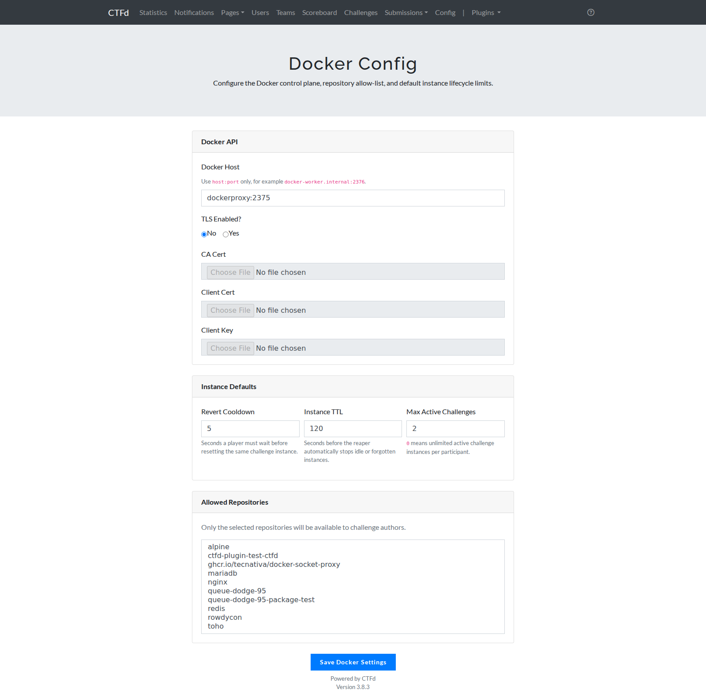
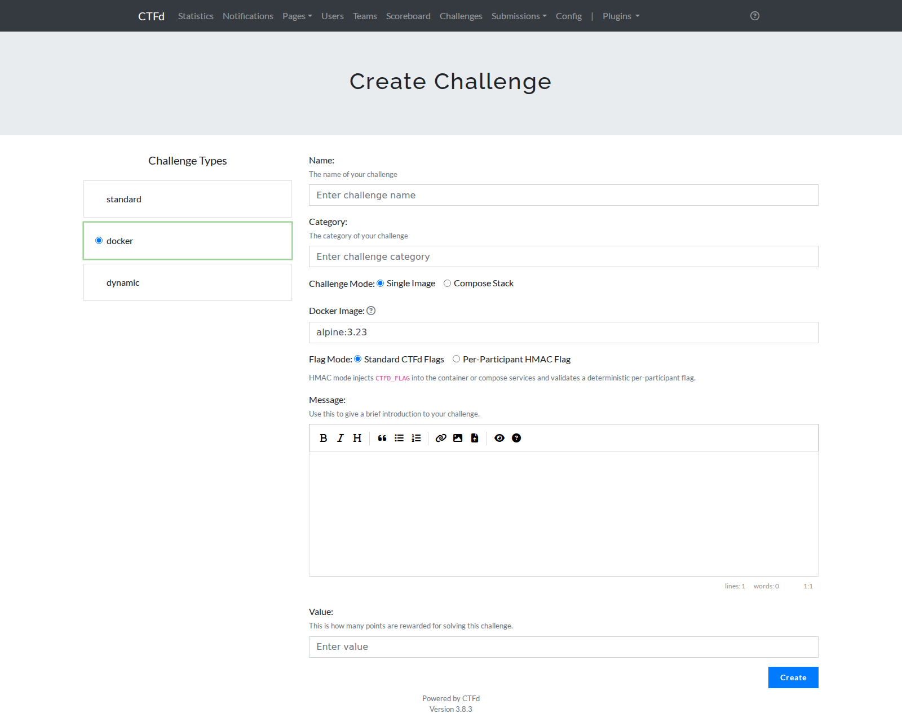
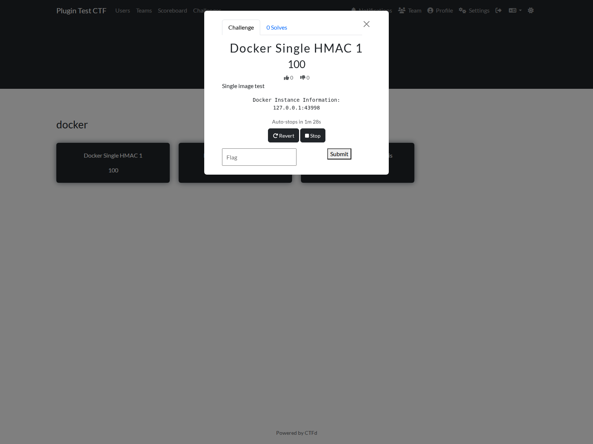
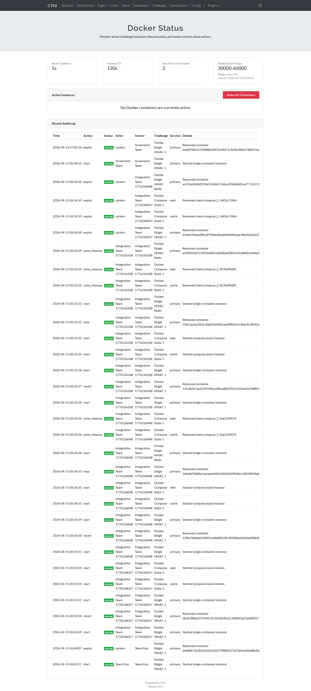

# Docker Challenge Plugin for CTFd

Adds a Docker-backed challenge type to CTFd. Players can start an isolated instance of a challenge container or compose stack, receive a dedicated connection port, and stop or revert their own environment without affecting other competitors.

The plugin publishes challenge ports directly from that same host, so players connect back to the CTFd machine at `HOST:PORT`.

## Screenshots

### Admin Docker Configuration



### Admin Challenge Creation



### Player Challenge View



### Admin Instance Status




## Current Setup does the following:

- CTFd talks to Docker through the internal proxy
- Players connect to the same public hostname they already use for CTFd
- Challenge containers still run on the same machine as CTFd

## Installation

1. Copy the plugin folder into your CTFd plugins directory:

```text
CTFd/plugins/docker_challenges
```

2. If you build CTFd as a Docker image, rebuild the image so the plugin requirements are installed.

3. Start or restart CTFd.

4. Open the plugin configuration page:

```text
/admin/docker_config
```

5. Open the runtime status page when needed:

```text
/admin/docker_status
```

## Recommended Docker Proxy Setup

For a single-host deployment, use a local `docker-socket-proxy` service and keep it on an internal Docker network with CTFd.

Example `docker-compose.yml` excerpt:

```yaml
services:
  ctfd:
    image: your-ctfd-image
    depends_on:
      - dockerproxy
    environment:
      DOCKER_CHALLENGE_PORT_MIN: 30000
      DOCKER_CHALLENGE_PORT_MAX: 34000
      DOCKER_CHALLENGE_PUBLIC_HOST: ctf.example.com
      DOCKER_CHALLENGE_HMAC_SECRET: replace-this-secret
    networks:
      - default
      - docker_internal

  dockerproxy:
    image: ghcr.io/tecnativa/docker-socket-proxy:latest
    restart: unless-stopped
    environment:
      CONTAINERS: 1
      IMAGES: 1
      NETWORKS: 1
      POST: 1
      ALLOW_START: 1
    volumes:
      - /var/run/docker.sock:/var/run/docker.sock:ro
    networks:
      - docker_internal

networks:
  docker_internal:
    internal: true
```

After the stack is up, configure the plugin with:

- **Docker Host**: `dockerproxy:2375`
- **TLS Enabled**: `No`


## Plugin Configuration in CTFd

Open `/admin/docker_config` and configure:

- **Docker Host**
  Use the proxy hostname and port, for example `dockerproxy:2375`.
- **Revert Cooldown**
  Minimum wait before the same player or team can reset the same challenge instance.
- **Instance TTL**
  Maximum lifetime for an active instance before automatic cleanup.
- **Max Active Challenges**
  Maximum number of active Docker challenge instances per player or team.
- **Allowed Repositories**
  Optional image allow-list shown to challenge authors.

## Host and Server Configuration

### Reserve a Dedicated Port Range

Pick a host port range only for Docker challenges.

Example:

```text
30000-34000
```

Set the same range for the plugin with:

```bash
DOCKER_CHALLENGE_PORT_MIN=30000
DOCKER_CHALLENGE_PORT_MAX=34000
```

Allow that range through the host firewall or cloud firewall rules.

### Set the Public Hostname

By default, the plugin uses the current request hostname for player connection details.

If CTFd is behind a reverse proxy or the public hostname should be fixed explicitly, set:

```bash
DOCKER_CHALLENGE_PUBLIC_HOST=ctf.example.com
```

### Size Docker Networks for Compose Challenges

Each compose stack gets its own Docker bridge network. For events with many concurrent compose instances, increase Docker’s default address pools on the host:

```json
{
  "default-address-pools": [
    { "base": "10.80.0.0/12", "size": 24 }
  ]
}
```

After updating `/etc/docker/daemon.json`, restart Docker.

### Pre-Pull Challenge Images

Pull challenge images onto the host before the event so launches are fast and predictable.

### Optional Global Resource Limits

You can apply default limits to all launched services:

```bash
DOCKER_CHALLENGE_MEMORY_LIMIT=512m
DOCKER_CHALLENGE_CPU_LIMIT=1.0
```

These act as defaults. Compose services can also set `mem_limit` and `cpus` individually.

## Environment Variables

| Variable | Purpose | Default |
| --- | --- | --- |
| `DOCKER_CHALLENGE_PORT_MIN` | First host port available for challenge instances | `30000` |
| `DOCKER_CHALLENGE_PORT_MAX` | Last host port available for challenge instances | `60000` |
| `DOCKER_CHALLENGE_PUBLIC_HOST` | Player-facing hostname for connection details | request host |
| `DOCKER_CHALLENGE_HMAC_SECRET` | Secret used for per-participant HMAC flag generation | CTFd `SECRET_KEY` |
| `DOCKER_CHALLENGE_REQUEST_TIMEOUT` | Docker API timeout in seconds | `10` |
| `DOCKER_CHALLENGE_REAPER_INTERVAL` | Background cleanup interval in seconds | `60` |
| `DOCKER_CHALLENGE_REVERT_COOLDOWN` | Default revert cooldown if not set in the admin UI | `300` |
| `DOCKER_CHALLENGE_CONTAINER_TTL` | Default instance TTL if not set in the admin UI | `7200` |
| `DOCKER_CHALLENGE_MAX_ACTIVE` | Default max active instances if not set in the admin UI | `0` |
| `DOCKER_CHALLENGE_MEMORY_LIMIT` | Default memory limit for launched services | unset |
| `DOCKER_CHALLENGE_CPU_LIMIT` | Default CPU limit for launched services | unset |
| `DOCKER_CHALLENGE_MAX_SERVICES` | Max services allowed in one compose challenge | `8` |
| `DOCKER_CHALLENGE_MAX_PUBLISHED_PORTS` | Max published ports allowed for one challenge instance | `16` |
| `DOCKER_CHALLENGE_PORT_RETRIES` | Port allocation retry attempts when Docker reports collisions | `5` |

`0` for `DOCKER_CHALLENGE_MAX_ACTIVE` means unlimited active Docker challenges per player or team.

## Creating Challenges

Go to **Admin Panel -> Challenges -> New Challenge** and select the `docker` type.

### Single Image Mode

Use this mode when one image is enough.

Requirements:

- The image must already exist on the host
- The image must expose at least one port in its Docker metadata
- Select which exposed container ports should be published to players. The plugin assigns the host-side ports automatically for each instance.

### Compose Stack Mode

Use this mode when the challenge needs multiple services.

Each launched compose stack gets:

- its own isolated Docker bridge network
- its own copies of every service in the stack
- random published host ports only for services that define `ports`

Services in the same stack can reach each other by service name, such as `http://api:5000`.

For ports, the important rule is:

- Put the container port your service listens on in `ports`
- The plugin chooses the host port automatically when the player launches the challenge

That means these two examples behave the same in this plugin:

```yaml
ports:
  - "1339"
```

```yaml
ports:
  - "1339:1339"
```

In both cases, the service listens on port `1339` inside the container, and the plugin replaces the host-side port with a random available port from the configured challenge range.

Example stack:

```yaml
services:
  portal:
    image: acme-ticketing-portal:latest
    depends_on:
      - api
    ports:
      - "8080"
    environment:
      PORT: "8080"
      PUBLIC_BASE_URL: "http://{{HOST}}:{{PORT}}"
      API_URL: "http://api:5000"
    entrypoint: /app/start-portal.sh

  api:
    image: acme-ticketing-api:latest
    depends_on:
      - review
    environment:
      PORT: "5000"
      REVIEW_URL: "http://review:7000"
    entrypoint: /app/start-api.sh

  review:
    image: acme-ticketing-review:latest
    environment:
      PORT: "7000"
      # Standard flag mode only: keep the shared flag in the variable your challenge already expects
      FLAG: "RCC{example_shared_flag}"
      # HMAC flag mode: remove the FLAG line above and make the service read CTFD_FLAG directly
    entrypoint: /app/start-review.sh
```

When a player launches this stack:

- The plugin keeps `portal` listening on container port `8080`.
- The plugin chooses a random host port for that service. If the chosen host port is `12345`, the result behaves like `12345:8080`.
- `{{PORT}}` becomes that published host port, such as `12345`.
- `{{HOST}}` becomes the player-facing hostname:
  `DOCKER_CHALLENGE_PUBLIC_HOST` if you set it, otherwise the current CTFd hostname from the request.
- The player will see connection details like `{{HOST}}:12345` in the challenge view.

Supported service fields are listed below. Other service fields are rejected so an unsupported Compose option cannot be silently ignored.

- `image`
- `ports`
- `environment`
- `depends_on`
- `command`
- `entrypoint`
- `cpus`
- `mem_limit`
- `cap_drop`
- `read_only`
- `pids_limit`

Common unsupported host-level options are rejected, including:

- `build`
- `privileged`
- `network_mode`
- `volumes`
- `devices`

Compose files are validated when the challenge is saved. Service names, ports, protocols, dependencies, environment entries, and resource values must be valid; dependency cycles and Compose files larger than 128 KB are rejected.

### Compose Placeholders

Compose environment values, command strings, and entrypoint strings can use:

- `{{HOST}}`
- `{{PORT}}`
- `{{PORT_service}}`
- `{{PORT_service_80}}`

Examples:

- `{{HOST}}` -> `ctf.example.com`
- `{{PORT}}` -> the first published port for the current service
- `{{PORT_web}}` -> the first published port for service `web`
- `{{PORT_web_80}}` -> the published host port mapped to target port `80` in service `web`

### Flag Modes

You can choose either:

- **Standard CTFd Flags**
- **Per-Participant HMAC Flag**

Use standard flags when the challenge should behave like a normal CTFd challenge and every participant submits the same flag value.

Use HMAC mode when each player or team should receive a different flag value for the same challenge instance. This prevents one participant from sharing a reusable flag string with others. The plugin generates the flag from the challenge ID and the current user or team ID, then validates submissions by recomputing that same value on the server.

HMAC mode only accepts the generated per-participant flag. Regular CTFd flags attached to the challenge are ignored while HMAC mode is enabled.

HMAC mode injects these runtime variables:

- `CTFD_FLAG`
- `CTFD_FLAG_MODE`
- `CTFD_CHALLENGE_ID`
- `CTFD_CHALLENGE_NAME`
- `CTFD_OWNER_ID`
- `CTFD_OWNER_NAME`
- `CTFD_OWNER_MODE`

If your challenge already has a hardcoded shared flag inside the image, keep the challenge in standard flag mode and use normal CTFd flags.

If your image expects a custom environment variable such as `CTF_FLAG_CHALLENGE`, the plugin does not rename `CTFD_FLAG` automatically. In that case, update the image or entrypoint to read `CTFD_FLAG` directly, or map it to your own variable in `command` or `entrypoint`, like the compose example above.

## Player Workflow

Players open the challenge and click **Start Docker Instance for challenge**.

The plugin then:

1. Launches a dedicated instance for that player or team.
2. Publishes the required port or ports on the host.
3. Shows the connection details in the challenge modal.
4. Lets the player stop or revert the instance.

For team-mode CTFd instances, players must be on a team before launching Docker challenges.

## Admin Workflow

Use these pages during the event:

- `/admin/docker_config`
  Configure Docker access, instance defaults, and allowed repositories.
- `/admin/docker_status`
  Review active instances, lifecycle state, expiry times, and recent lifecycle actions.

The plugin records each logical instance as `creating`, `running`, `deleting`, `stopped`, or `failed`. Its background cleanup also reconciles plugin-labeled Docker containers and networks with the database, removes abandoned resources, and clears trackers for containers that exited or disappeared.
